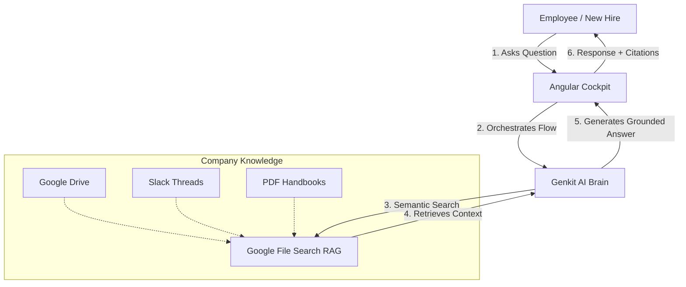

# Onboard HQ

Onboard HQ is a centralized, AI-powered "Command Center" designed to transform a company’s fragmented internal documentation into an interactive, high-velocity knowledge base.

Instead of forcing new hires and employees to manually dig through scattered Google Drive folders, Slack threads, or dense PDF handbooks, Onboard HQ provides a single, conversational interface where they can ask questions in plain language and receive immediate, grounded answers.

## 🚀 Core Functionalities

- **Natural Language Retrieval**: Employees can ask, "How do I set up my VPN?" or "What is our policy on hybrid work?" and receive a concise answer instantly, rather than a list of 50 files to read.
- **Verified Citations**: To ensure accuracy and build trust, every response includes clickable links to the exact internal source document (PDF, CSV, or Doc) used to generate the answer.
- **Automated Knowledge Ingestion**: Using Google’s File Search, the platform automatically "reads," chunks, and indexes company documents without requiring manual data entry or complex vector database management.
- **Centralized Resource Hub**: Beyond the AI chat, it serves as a modern Angular dashboard for tracking onboarding progress, accessing key forms, and viewing company-wide announcements.

## 🏗️ Technical Foundation

The app demonstrates a "Zero-Infrastructure" approach to enterprise AI:

- **Angular**: A structured, high-performance frontend for the "Cockpit" experience.
- **Genkit**: The "Brain" that orchestrates the AI flows and prompt logic.
- **Google File Search (RAG)**: The managed engine that handles the complex math of searching through thousands of pages of text.

## 🔄 How it Works



### 🧠 Core Genkit Logic
The heart of Onboard HQ is a Genkit flow that connects the LLM to Google's File Search engine.

```typescript
// functions/src/index.ts
export const _chatWithFileSearchLogic = ai.defineFlow(
  {
    name: 'chatWithFileSearch',
    inputSchema: z.object({
      question: z.string(),
      history: z.array(conversationMessageSchema).optional(),
    }),
    outputSchema: z.string(),
  },
  async({question, history}) => {
    // ... (fetch store name from Firestore)
    const response = await ai.generate({
      system: CHAT_WITH_FILE_SEARCH_SYSTEM_PROMPT,
      messages: [
        ...toGenkitMessages(history ?? []),
        {role: 'user', content: [{text: question}]},
      ],
      config: {
        tools: [{ fileSearch: { fileSearchStoreNames: [storeName] } }]
      }
    });
    return response.text;
  }
);
```

### ⚡ Angular Integration
The frontend communicates with the Genkit flow using Firebase Functions.

```typescript
// src/app/services/chat.service.ts
@Injectable({ providedIn: 'root' })
export class ChatService {
  private functions = inject(Functions);

  async sendMessage(data: ChatInput): Promise<string> {
    const chatFn = httpsCallable<ChatInput, string>(
      this.functions,
      'chatWithFileSearch'
    );
    const result = await chatFn(data);
    return result.data;
  }
}
```

## 💬 Example Handbook Questions
Try asking these common onboarding and policy questions:

- "What is our policy on hybrid and remote work?"
- "How do I set up my corporate VPN and email?"
- "Tell me about the company's culture and values"

---

This project was generated using [Angular CLI](https://github.com/angular/angular-cli) version 21.1.2.

## Configuration & Secrets

To set the `GEMINI_API_KEY` in your Firebase project, run:

```bash
cd functions
firebase functions:secrets:set GEMINI_API_KEY
```

## Development server

To start a local development server, run:

```bash
ng serve
```

Once the server is running, open your browser and navigate to `http://localhost:4200/`. The application will automatically reload whenever you modify any of the source files.

## Code scaffolding

Angular CLI includes powerful code scaffolding tools. To generate a new component, run:

```bash
ng generate component component-name
```

For a complete list of available schematics (such as `components`, `directives`, or `pipes`), run:

```bash
ng generate --help
```

## Building

To build the project run:

```bash
ng build
```

This will compile your project and store the build artifacts in the `dist/` directory. By default, the production build optimizes your application for performance and speed.

## Running unit tests

To execute unit tests with the [Vitest](https://vitest.dev/) test runner, use the following command:

```bash
ng test
```

## Running end-to-end tests

For end-to-end (e2e) testing, run:

```bash
ng e2e
```

Angular CLI does not come with an end-to-end testing framework by default. You can choose one that suits your needs.

## Additional Resources

For more information on using the Angular CLI, including detailed command references, visit the [Angular CLI Overview and Command Reference](https://angular.dev/tools/cli) page.
